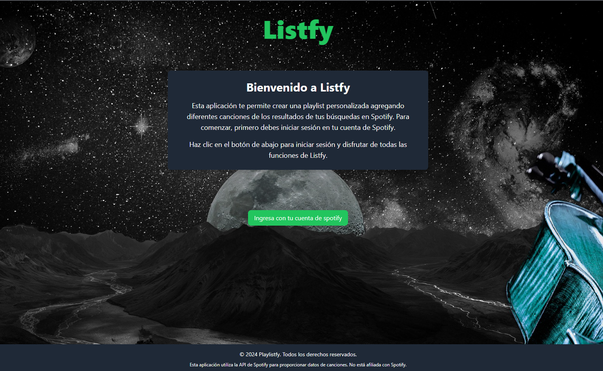

# 👨‍💻 Miguel Osorio - Desarrollador de Software

¡Bienvenido a mi portafolio personal! Soy **Miguel Osorio**, un apasionado desarrollador de software especializado en desarrollo web, fusionando lógica y creatividad para construir experiencias digitales atractivas.

## 🌟 Sobre mí
Soy **Ingeniero de Sistemas** de Colombia, dedicado a aprender y aplicar las últimas tecnologías en desarrollo web. Mi objetivo es entregar soluciones innovadoras y eficientes a través de un código limpio y mantenible.

🚀 **Tecnologías que utilizo:**
- **HTML5** 🏗️
- **CSS3** 🎨
- **JavaScript** ⚙️
- **React** ⚛️
- **Git & GitHub** 🔧

## 🖥️ Proyectos

### 🎯 [Juego de Adivinar Números](https://nowguesser.netlify.app/)
Este es un juego donde tú y la computadora eligen un número. El ganador se determina por quién adivina el número más cercano al objetivo.

### 🎵 [Listfy - Playlists Personalizadas con Spotify](https://listfynow.netlify.app/)
Listfy es una aplicación web que te permite crear listas de reproducción personalizadas usando canciones de Spotify. Con la ayuda de la API de Spotify, puedes buscar canciones, agregarlas a tu playlist y guardarla directamente en tu cuenta de Spotify.

## 📫 Contáctame

No dudes en ponerte en contacto conmigo a través de las siguientes plataformas:

- [LinkedIn](https://www.linkedin.com/in/miguel-%C3%A1ngel-osorio-londo%C3%B1o-940218206/) 💼
- [WhatsApp](https://wa.me/573059116668) 📱
- [Gmail](mailto:miguelosorio1904@gmail.com) ✉️
- [GitHub](https://github.com/Daijaz?tab=overview&from=2024-03-01&to=2024-03-15) 👨‍💻

## 📄 Descarga mi CV
Puedes descargar mi CV [aquí](./assets/docs/CV-MiguelOsorio.pdf) 📄.

## 🔧 Herramientas y Tecnologías

Estas son algunas de las tecnologías y herramientas con las que trabajo:

- **HTML5** 🏗️
- **CSS3** 🎨
- **JavaScript (ES6+)** ⚙️
- **React** ⚛️
- **Git & GitHub** 🔧
- **API de Spotify** 🎵

## 🏆 Habilidades

Mis áreas de experiencia incluyen:

- **Desarrollo Web:** Creación de interfaces responsivas, eficientes y centradas en el usuario.
- **Control de Versiones:** Gestión de código con Git y colaboración en GitHub.
- **Integración de APIs:** Utilización de APIs externas como la API de Spotify para crear aplicaciones dinámicas.
- **Resolución de Problemas:** Abordar desafíos complejos con enfoques lógicos y creativos.

---

¡Gracias por visitar mi portafolio! Siempre estoy interesado en colaborar en nuevos proyectos emocionantes y explorar ideas innovadoras. ¡No dudes en conectarte conmigo! 😄
